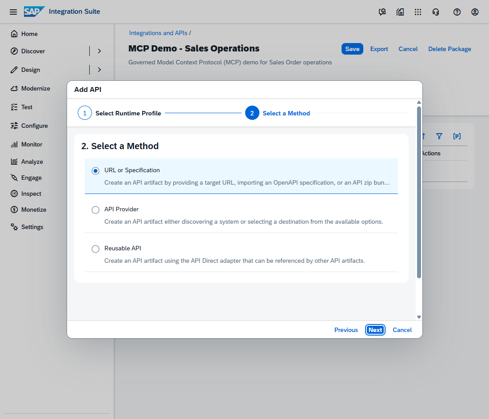
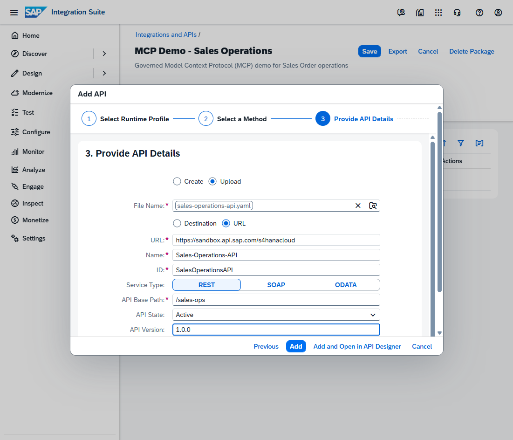
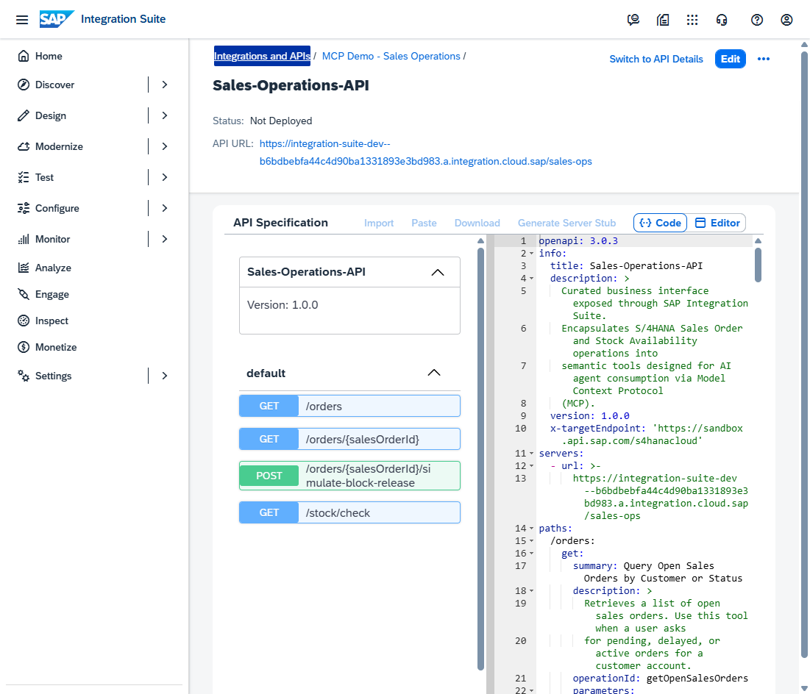
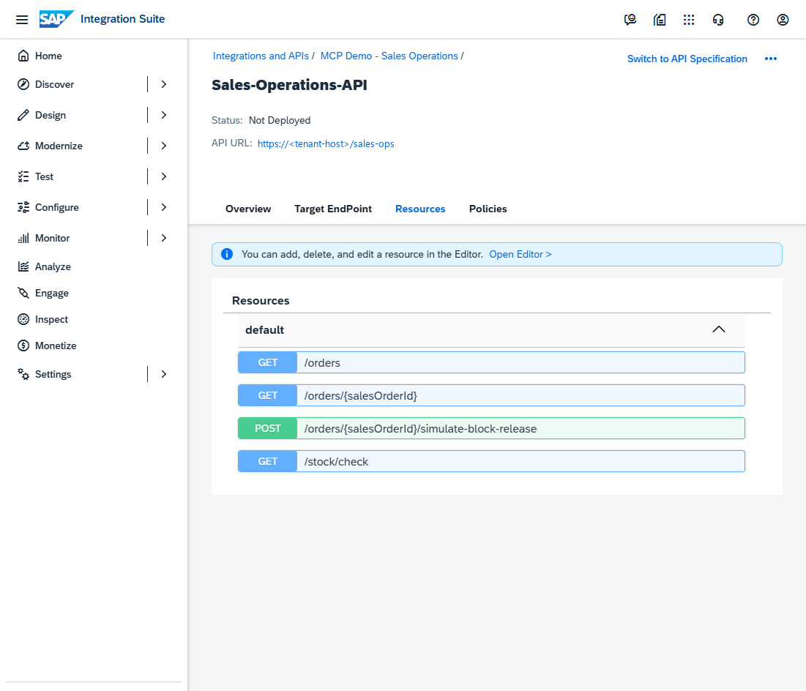
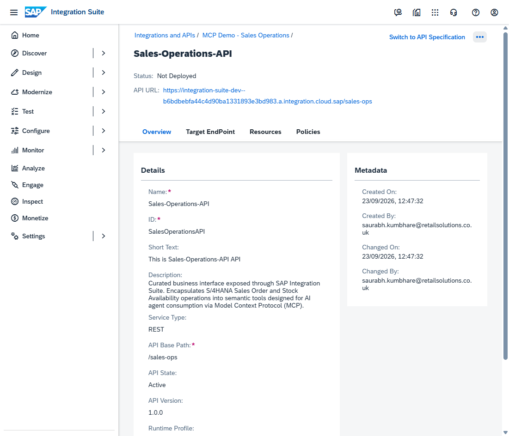
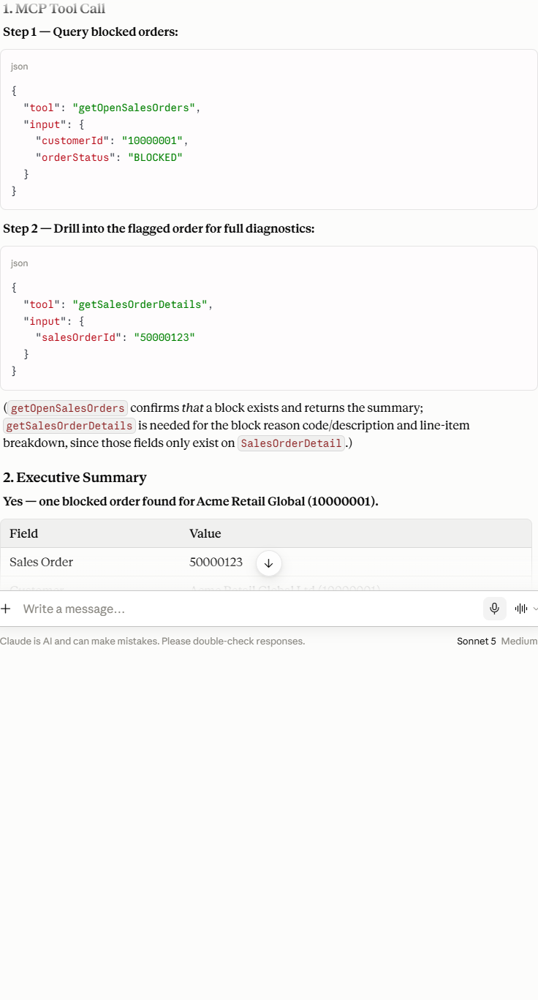
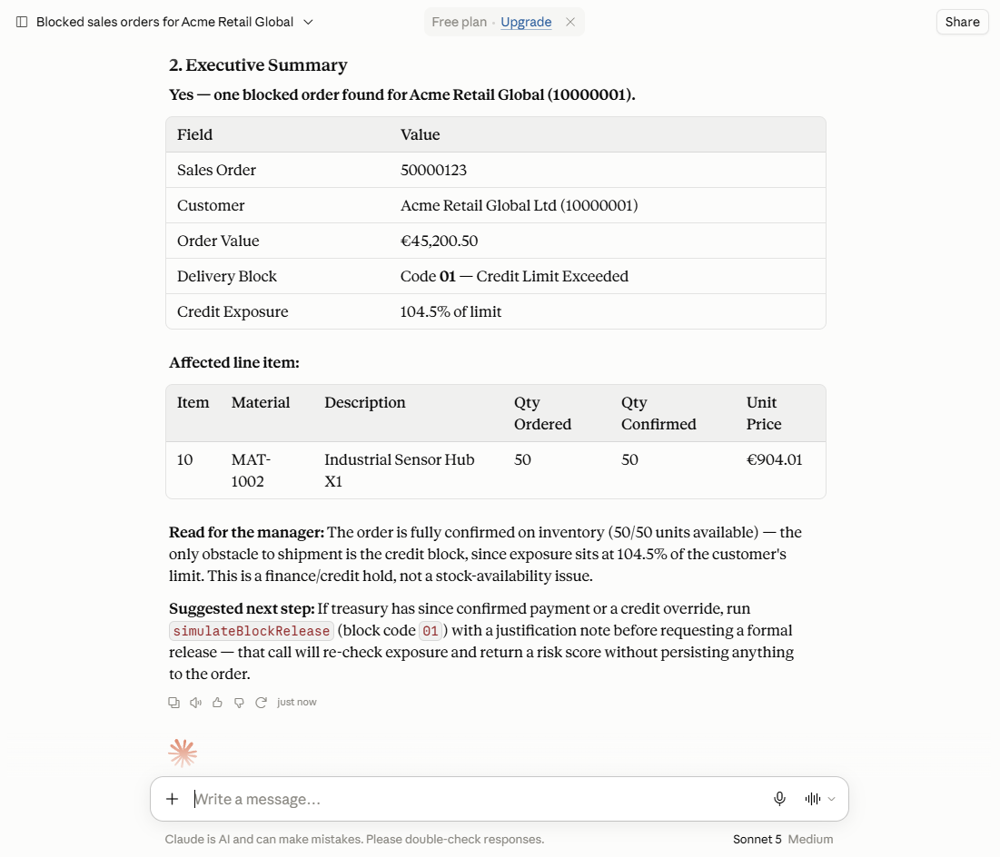
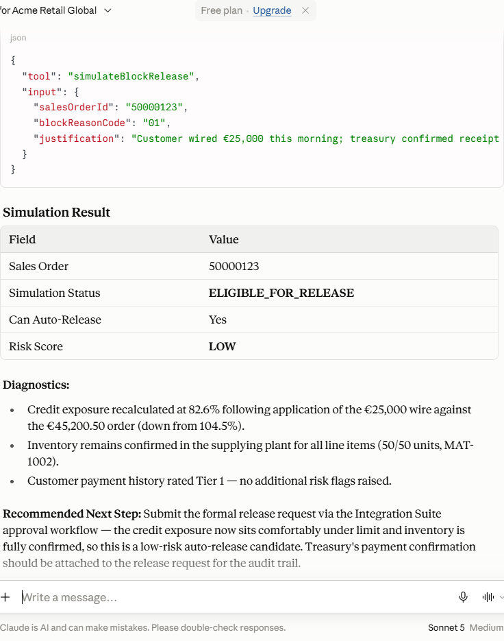

# SAP Integration Suite MCP Gateway — Step-by-Step Setup Guide

> **Live Walkthrough Document** — Completed and verified live in tenant.
> Based on official SAP Help Portal documentation.
> Reference: [help.sap.com – Creating an MCP Server](https://help.sap.com/docs/integration-suite)

---

## Progress Tracker

| Phase | Step | Description | Status |
|---|---|---|---|
| **0** | 0.1 | Confirm tenant details & capabilities | ✅ **COMPLETE** |
| **0** | 0.2 | Confirm Integration Cell runtime status | ✅ **COMPLETE** |
| **1** | 1.1 | Verify required BTP roles are assigned | ✅ **COMPLETE** |
| **2** | 2.1 | Create Integration Package | ✅ **COMPLETE** |
| **2** | 2.2 | Add API Artifact on Integration Cell (Method Selection) | ✅ **COMPLETE** |
| **2** | 2.3 | Provide API Details & Upload Specification | ✅ **COMPLETE** |
| **2** | 2.4 | Create & Validate API Artifact in API Designer | ✅ **COMPLETE** |
| **3** | 3.1 | Inspect API Details & Verify Curated Tool Resources | ✅ **COMPLETE** |
| **3** | 3.2 | Deploy API Artifact & Analyze Runtime Profile Behavior | ✅ **COMPLETE** |
| **4** | 4.1 | Configure Client Security & Endpoint Mapping | ✅ **COMPLETE** |
| **5** | 5.1 | Protocol Verification via Automated Test Client | ✅ **COMPLETE** |
| **5** | 5.2 | Live Testing in Claude AI (Tool Calls & Action Simulation) | ✅ **COMPLETE** |

---

# ✅ PHASE 0 — Tenant & Runtime Readiness Check

- **Global Account:** `<your-global-account>` (`<global-account-id>`)
- **Subaccount:** `<your-subaccount-name>` (`<subaccount-id>`)
- **Tenant ID:** `<your-tenant-id>` (`<region>`)
- **Integration Cell (cloud):** 🟢 **ACTIVE** (verified in `Settings → Runtimes`)
- **Active Capabilities:** Cloud Integration, API Management, Event Mesh, Trading Partner Management

---

# ✅ PHASE 1 — Role Verification

Verified via BTP Cockpit (`Security → Users` for `<your-developer-user>`):
- `PI_Integration_Developer` ✅ Assigned (Role #24)
- `PI_Administrator` ✅ Assigned (Role #23)
- `APIPortal.Administrator` ✅ Assigned (Role #2)
- `APIManagement.SelfService.Administrator` ✅ Assigned (Role #1)
- `Subaccount Administrator` ✅ Assigned (Role #26)

---

# ✅ PHASE 2 — Integration Package & API Artifact Setup

## Step 2.1 — Create Integration Package
- **Package Name:** `MCP Demo - Sales Operations`
- **Technical ID:** `MCPDemoSalesOperations`
- **Short Description:** `Governed Model Context Protocol (MCP) demo for Sales Order operations`
- **Mode:** `Editable`
- **URL:** `https://<your-tenant-host>/shell/design/contentpackage/MCPDemoSalesOperations?section=ARTIFACTS`

## Step 2.2 — Add API Wizard (Integration Cell Runtime)
- **Step 1 (Runtime Profile):** Switched from default `Cloud Integration` to **`Integration Cell`**.
- **Step 2 (Select a Method):** Selected **`URL or Specification`**.



## Step 2.3 — Upload Specification & Configure API Details
- **Mode:** `Upload`
- **Specification:** `sales-operations-api.yaml` (OpenAPI 3.0.3)
- **Target URL:** `https://sandbox.api.sap.com/s4hanacloud`
- **API Name:** `Sales-Operations-API`
- **API ID:** `SalesOperationsAPI`
- **Service Type:** `REST`
- **API Base Path:** `/sales-ops`
- **State:** `Active` | **Version:** `1.0.0`
- **Virtual Host:** `<integration-cell-virtual-host>.integration.cloud.sap`



## Step 2.4 — API Designer Validation
- Successfully loaded with Swagger UI.
- All 4 operations confirmed loaded and validated:
  1. `GET /orders` (`getOpenSalesOrders`)
  2. `GET /orders/{salesOrderId}` (`getSalesOrderDetails`)
  3. `POST /orders/{salesOrderId}/simulate-block-release` (`simulateBlockRelease`)
  4. `GET /stock/check` (`checkMaterialStock`)



---

# ✅ PHASE 3 — Governance & Runtime Deployment

## Step 3.1 — API Details & Tool Resources
- Inspected Overview, Target EndPoint, Resources, and Policies tabs.
- Policy editor available for Traffic Management (Spike Arrest / Quota) and Security.



## Step 3.2 — Runtime Deployment
- Targeted to **Integration Cell** runtime.
- Clicked `[More] → [Deploy]`.



---

# 🔍 Architectural Note: How This Differs from SAP Graph (Unified Data Graph)

In SAP Integration Suite, **SAP Graph** (now part of API Management as the Business Data Graph) provides a unified GraphQL/OData REST API across S/4HANA, SuccessFactors, CX, and Ariba.

| Architectural Dimension | **SAP Graph** (Unified Business Data Graph) | **SAP Integration Suite MCP Gateway** |
|---|---|---|
| **Core Paradigm** | **Data & Entity Centric** — Models enterprise data entities and the relationships between them across SAP systems. | **Task & Intent Centric** — Exposes discrete, action-oriented business capabilities tailored for AI agent execution. |
| **Target Consumer** | **Traditional Developers & Applications** building UIs, mobile apps, analytics, and deterministic backend services. | **AI Assistants & Autonomous Agents** (Claude Desktop, Cursor, Joule, AutoGen, LangGraph) operating probabilistically. |
| **Communication Protocol** | OData v4 / GraphQL REST endpoints with deep entity navigation. | **Model Context Protocol (MCP)** standard (JSON-RPC 2.0 over stdio / SSE). |
| **Interface Complexity** | **Relational & Navigational**: Requires querying complex entity graphs and handling navigation properties. | **Semantic Tools**: Flat, intention-driven tools (`simulate_block_release`) with strict input schemas and plain-English descriptions. |
| **Cognitive Load on LLM** | **High**: The LLM must construct complex OData queries and parse large multi-page JSON payloads. | **Minimal**: The LLM chooses the matching tool and provides 1–3 clean key-value arguments. |
| **Governance & Safety** | Entity-level authorization and CRUD data access controls. | **Pre-execution simulation**, action-level audit logging, rate limiting (Spike Arrest), and human-in-the-loop approvals. |

> **💡 The "Better Together" Pattern:**
> An MCP Tool in SAP Integration Suite can internally query SAP Graph to traverse cross-system data (e.g. S/4HANA Order + CX Ticket), synthesize the result into a clean 5-line summary, and return it to the AI agent without cluttering the LLM's context window.

---

# ✅ PHASE 4 & 5 — Client Connection & Live Claude AI Testing

## Automated MCP Protocol Verification (`test_client.py`)
Executed automated JSON-RPC stdio protocol test:
- `initialize` handshake succeeded: `SAP-Integration-Suite-MCP-Gateway v1.0.0`
- `tools/list` discovered all 4 tools.
- `tools/call` for `get_open_sales_orders` returned Order #50000123.
- `tools/call` for `simulate_block_release` returned status `ELIGIBLE_FOR_RELEASE` (Risk: `LOW`).

## Live Testing in Claude AI (Web)

### Test Scenario 1: Query Blocked Orders & Diagnostics
- **Prompt:** *"Are there any blocked sales orders for customer 10000001 (Acme Retail Global)? If so, what is the order value, the delivery block reason, and the affected line items?"*
- **Claude MCP Tool Calls Emitted:**
  ```json
  // Call 1
  {"tool": "getOpenSalesOrders", "input": {"customerId": "10000001", "orderStatus": "BLOCKED"}}
  // Call 2
  {"tool": "getSalesOrderDetails", "input": {"salesOrderId": "50000123"}}
  ```



- **Executive Findings Returned:**
  - Order `#50000123` on Credit Block `01` (`104.5%` exposure).
  - Value: `€45,200.50`.
  - Inventory: 50/50 units of `MAT-1002` confirmed in stock.
  - Identification: Finance hold, not a warehouse availability issue.



### Test Scenario 2: Action Simulation (`simulateBlockRelease`)
- **Prompt:** *"Treasury has confirmed that the customer wired €25,000 this morning. Simulate releasing delivery block 01 on order 50000123 with this justification. What is the simulated credit exposure, risk score, and recommended next step?"*
- **Claude MCP Tool Call Emitted:**
  ```json
  {
    "tool": "simulateBlockRelease",
    "input": {
      "salesOrderId": "50000123",
      "blockReasonCode": "01",
      "justification": "Customer wired €25,000 this morning; treasury confirmed receipt of payment against outstanding credit exposure."
    }
  }
  ```
- **Simulation Response:**
  - Status: `ELIGIBLE_FOR_RELEASE`
  - Risk Score: `LOW`
  - Recalculated Credit Exposure: **`82.6%`** (comfortably under the 100% threshold).
  - Recommended Next Step: Proceed with formal release request attaching treasury wire confirmation.



---

# 🎯 Your Next Steps

1. **Publish to GitHub**:
   ```bash
   git init
   git add .
   git commit -m "feat: complete SAP Integration Suite MCP Gateway POC and guide"
   git remote add origin https://github.com/saurabhakumbhare/IntegrationSuiteMCPDemo.git
   git branch -M main
   git push -u origin main
   ```
2. **Present Internally**:
   Share with practice leads and architects as the enterprise-grade reference pattern for Agentic AI on SAP BTP.
